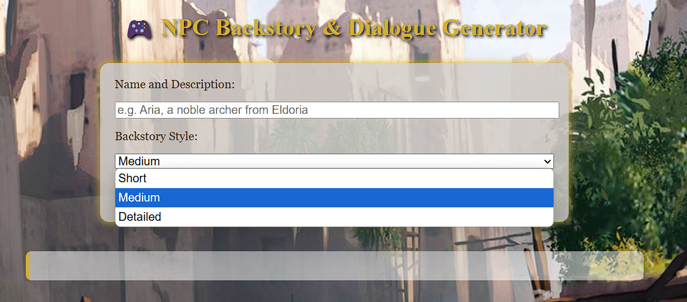
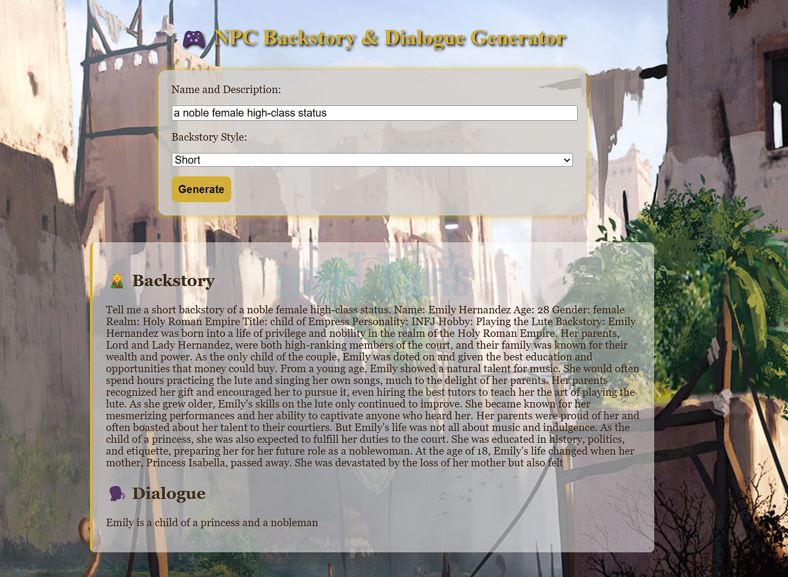

# 🎮 NPC Backstory & Dialogue Generator

This project is an **AI-powered web app** that generates **RPG-style backstories** and **mission dialogues** for fantasy NPCs. It's built with **FastAPI**, styled with medieval fantasy flair, and powered by a fine-tuned **DistilGPT-2** model.

---

## 🔧 Features

- Generate rich, fantasy-inspired character backstories
- Automatically create matching RPG-style NPC missions
- Lightweight model suitable for CPU usage (DistilGPT-2)
- Stylized HTML interface with a medieval RPG look

---

## 🚀 How to Run It

### ✅ Local Setup
> Make sure you have `Python 3.8+`, `pip`, and `virtualenv` or `conda`.

1. **Clone this repository**
   ```bash
   git clone https://github.com/yourusername/npc-backstory-generator.git
   cd npc-backstory-generator
   ```

2. **Install dependencies**
   ```bash
   pip install -r requirements.txt
   ```

3. **Run the FastAPI server**
   ```bash
   uvicorn api:app --reload
   ```

4. **Open the app**
   - Go to: `http://localhost:8000` in your browser
   - Make sure the frontend assets (HTML/CSS) are correctly located in `frontend_html/` and `frontend_css/` folders

---

## 💾 Dataset

- **Source**: `/kaggle/input/synthnobilitas-ai-generated-noble/noble_data.jsonl`
- **Details**: Custom-generated noble NPC dataset including:
  - `Name`, `Age`, `Sex`, `Realm`, `Title`, `MBTI Personality`, `Hobby`, and `Backstory`
- **Processing**:
  - Converted to natural prompt format
  - Tokenized using GPT-2 tokenizer
  - Fine-tuned on `DistilGPT-2` with prompt + backstory

---

## 🧠 Models Used

- **Backstory Generator**: Fine-tuned `distilgpt2` (lightweight & CPU-friendly)
- **Mission Generator**: Pre-trained `google/flan-t5-large` (for creative text generation)

> 💡 Consider replacing `flan-t5-large` with `flan-t5-small` or `flan-t5-base` if memory is an issue.

---

## 📝 Sample Input/Output

### 🧝 Prompt:
> `Aria, a noble archer from Eldoria`

### ✨ Output:
**Backstory**:
> Aria, born into the noble house of Silvaran, trained in the moonlit forests of Eldoria. Gifted with elven precision and a burning sense of justice, she turned from palace life to protect the borders from dark spirits that plague the land...

**Dialogue / Missions**:
- Help Aria retrieve a lost heirloom bow from the cursed ruins
- Escort a merchant caravan through haunted woods
- Investigate shadowy dealings near the Elden border

*(📸 Screenshot )*
- Screenshot of UI before Backstory Generation 

- Screenshot of UI after Backstory Generation 



---

## 📁 Project Structure

```
├── api.py               # FastAPI backend logic
├── frontend_html/       # HTML templates
│   └── frontend.html
├── frontend_css/        # Medieval-styled CSS
│   └── frontend.css
├── finetuned-distilgpt2-backstory/ # Trained model directory
├── red-pandas-gaming-assignment.ipynb # Notebook for fine-tuning
└── README.md            # You're here!
```

---

## ✍️ Author

Built by **Ashish Asmit** for the **Red Pandas Gaming Assignment** 🐾  
> Proudly trained with 💻 CPU power and imagination.
